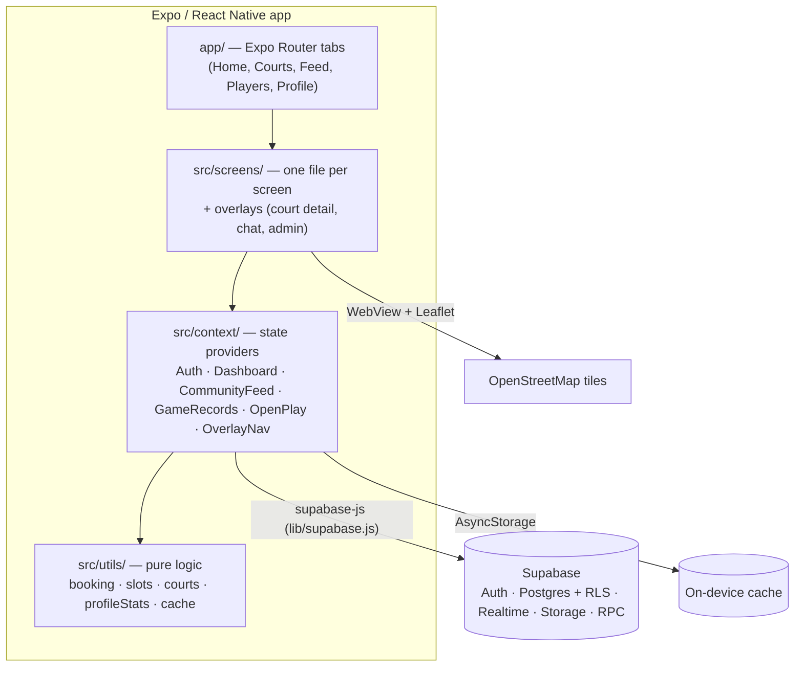

# DinkTagum

DinkTagum is a mobile app (Android, iOS and web) that helps pickleball players in Tagum City find an open court, book it without double-booking, and fill a game with players at their level.

## The problem

Pickleball is growing fast in Tagum City, but the information players need is scattered:

- **Courts are hard to find and compare.** Venues are spread across barangays. Hours, prices, lighting and surface are posted, if at all, on separate Facebook pages.
- **Booking is done by chat or walk-in.** Players message a court contact and wait. Two groups can end up holding the same slot, and nobody can see what's still free.
- **Finding a game is luck.** A player who has one or three friends free can't easily find others at a similar skill level to complete a Singles or Doubles game.
- **Results aren't tracked.** Players have no shared record of matches, wins or progress.

### Target users

| User | Needs |
|---|---|
| **Recreational and competitive players** in Tagum City | Find a nearby open court, book an hour, join or host a game at their skill level, track their record |
| **Court managers and admins** | Keep court details current, confirm or cancel bookings, close a court for maintenance, moderate the community |

## Core features

The app is organized around one main flow: **find a court → book a slot → fill the game → record the result.**

| Feature | What it does | Where |
|---|---|---|
| **Court finder** | List and map of courts with filters (surface, price, lighting, amenities, open now, favorites) and sorting (nearest, top rated, cheapest, available now) | `src/screens/CourtsScreen.jsx`, `src/utils/courts.js` |
| **Slot booking** | Pick up to 4 consecutive hours, see the total price, add to calendar, get a reminder. Overlapping bookings are rejected by the database itself | `src/screens/CourtDetail.jsx`, `src/utils/booking.js` |
| **Open Play** | Host a Singles/Doubles pickup game at a court with a skill range. Others join until it's full | `src/screens/OpenPlay.jsx`, `src/context/OpenPlayContext.jsx` |
| **Match records** | Log scores, tag a registered opponent who then confirms the result, see win rate and streak | `src/screens/HistoryScreen.jsx`, `src/utils/profileStats.js` |
| **Player directory** | Find players by skill, game type and usual playing times, then connect or chat | `src/screens/PlayersScreen.jsx` |
| Supporting | Community feed, realtime chat, notifications, admin console | `src/screens/` |

### Application logic beyond basic data entry

1. **Booking engine** (`src/utils/booking.js`, `src/utils/slots.js`). Tapping a slot extends, trims or restarts the selection, keeping it to consecutive free hours (max 4). It also checks time-range overlap against existing reservations, finds the next available slot across several days, picks the reminder time (1 h, or 15 min if the hour has passed), and computes the price.
2. **Double-booking prevention in the database.** The `reservations` table uses a PostgreSQL `EXCLUDE USING gist` constraint on court and time range, so two players can never hold overlapping slots, even if they tap "Book" at the same moment. The app translates that conflict into "That time slot was just taken."
3. **Court availability ranking** (`src/utils/courts.js`). Opening hours are parsed from free text ("6AM–10PM", "06:00 - 22:00") and handle courts that close after midnight. The app works out whether a court is open now, finds its next bookable slot, measures straight-line (haversine) distance from the player, and ranks courts by real availability.
4. **Open Play matchmaking** (`src/context/OpenPlayContext.jsx`). Capacity depends on format, skill ranges are enforced, and the time is checked against the clock. Joining and leaving go through database functions so a game can't be overfilled.
5. **Player statistics** (`src/utils/profileStats.js`). Win rate, win/loss ratio, current streak and recent form are computed from match records. Opponent confirmation means a recorded result can be verified.
6. **Offline cache** (`src/utils/cache.js`). The last profile, court list and bookings are saved on the device, so the app opens instantly and still works with no signal.

## Architecture



- **Expo SDK 57 / React Native** for Android, iOS and web.
- **Expo Router** provides the app entry and tab navigation (`app/`, thin route files). Court details, chat, notifications and admin open as full-screen overlays managed by `OverlayNavContext`, and the Android back button closes them.
- **`src/screens/`** has one file per screen, plus `shared.jsx` for the theme, shared styles and small UI pieces. The admin console is split into `AdminTab.jsx` and `src/screens/admin/` (form rules, court form, photo manager, court row).
- **`src/context/`** splits app state into focused providers: `AuthContext` (session), `DashboardContext` (profile, courts, reservations, location), `CommunityFeedContext` (posts), `GameRecordsContext` (matches), `OpenPlayContext` (pickup games) and `OverlayNavContext` (which overlay is open). Everything except Auth is mounted only while signed in and keyed by user id, so signing out discards their state.
- **`src/utils/`** holds pure functions with no React or Supabase code, which is where the business rules live and where most tests point.
- **`lib/supabase.js`** configures the Supabase client. The login session is stored in `expo-secure-store` (split into chunks to fit its size limit).
- **`src/components/`** holds the app shell, tab bar, feedback (toasts and sheets) and the court map.
- **`supabase/migrations/`** is the **only** source of truth for schema, row-level security, triggers and RPC functions.

### Data persistence and async handling

- **Login session** survives app restarts (secure store).
- **Dashboard data** (profile, courts, your reservations) is cached on the device per user. On launch the cache is shown right away, then replaced by fresh data. If the network fails, the app keeps the cached data and says how old it is ("You're offline. Showing data saved 5 min ago").
- **Loading states:** skeleton cards for courts and posts, spinners on buttons while saving, and pull-to-refresh on Home, Courts, Feed, Players and History.
- **Realtime:** chat messages, notifications, posts and match confirmations arrive live through Supabase Realtime.
- **Optimistic updates:** favoriting a court flips the heart immediately and rolls back if the write fails.

### Validation and error handling

- The sign-in/sign-up, court admin, match log and profile forms validate on the device and show a message **under the field that's wrong**. The rules in `validateAuthFields`, `courtFieldErrors`, `gameRecordFieldErrors` and `profileFieldErrors` mirror the database check constraints.
- Database errors are translated into plain language (e.g. overlapping booking, court still has reservations).
- `AppErrorBoundary` catches render crashes and offers a retry instead of a blank screen.

## Project structure

```
app/                 Expo Router routes (thin wrappers around screens)
lib/supabase.js      Supabase client + secure session storage
src/components/      App shell, tab bar, toasts/sheets, court map (native + web)
src/context/         State providers (see Architecture)
src/screens/         Screens and overlays; admin/ holds the admin console pieces
src/utils/           Pure business logic (booking, slots, courts, stats, cache, format)
supabase/migrations/ Schema, RLS policies, triggers and RPC functions
scripts/             Test-data seeding and Tagum court import (service role key only)
```

## Prerequisites

- **Node.js 20 LTS** or newer, and npm.
- **Git**.
- The **Expo Go** app on your phone ([iOS](https://apps.apple.com/app/expo-go/id982107779) / [Android](https://play.google.com/store/apps/details?id=host.exp.exponent)) for the fastest way to run the app on a device — no native build tooling required.
- Optional, for emulators instead of a physical device: Android Studio (Android) or Xcode on macOS (iOS).
- A free [Supabase](https://supabase.com) account and project (see [Database setup](#database-setup)).

## Setup

```bash
git clone https://github.com/<your-username>/dink-tagum.git
cd dink-tagum
npm install
cp .env.example .env.local
npx expo start
```

On Windows PowerShell, copy the environment file with:

```powershell
Copy-Item .env.example .env.local
```

## Environment configuration

Add the following public client values to `.env.local`:

```dotenv
EXPO_PUBLIC_SUPABASE_URL=https://your-project.supabase.co
EXPO_PUBLIC_SUPABASE_PUBLISHABLE_KEY=your-publishable-key
```

Get the Supabase URL and publishable key from **Supabase Dashboard → Settings → API**. Never place a Supabase secret or service-role key in an Expo environment file.

## Database setup

If you're starting from a fresh Supabase project, link it to this repo first:

```bash
npx supabase login
npx supabase link --project-ref your-project-ref
```

The project ref is the subdomain in your project's URL (`https://<project-ref>.supabase.co`), also shown under **Supabase Dashboard → Settings → General**.

Then apply migrations with the Supabase CLI (do **not** run the legacy, pre-migration SQL files kept in `supabase/_archive/` for historical reference — they predate the hardened RLS policies and will not match the current schema):

```bash
npx supabase db reset
# or, against a linked remote project:
npx supabase db push
```

Assign administrators in Supabase Auth by setting `app_metadata.role = 'admin'`.

### Test data

`scripts/seed-test-data.mjs` creates six fictional player accounts (`@dinktagum.test`) with profiles, community posts, match history, court reservations, and chat messages, so the app has realistic data to test against. It needs the project's **service role key** (never put this in `.env.local` — it bypasses RLS and must never ship in the app):

```powershell
$env:EXPO_PUBLIC_SUPABASE_URL="https://your-project.supabase.co"
$env:SUPABASE_SERVICE_ROLE_KEY="your-service-role-key"
npm run seed:test-data
```

Re-running it is safe — it only ever touches rows owned by those six test accounts. To remove the test accounts and all their data instead of recreating it, run `npm run seed:test-data:purge` with the same environment variables set.

Maps use Leaflet with OpenStreetMap tiles inside `react-native-webview`, which works out of the box in Expo Go, Android, iOS, and Web without requiring custom native Mapbox builds.

## Run the app

Start the development server:

```bash
npx expo start
```

- **Physical device:** open the Expo Go app and scan the QR code printed in the terminal.
- **Android emulator:** connect a device/emulator, then press `a`, or run `npm run android`.
- **iOS simulator:** on macOS with Xcode, press `i`, or run `npm run ios`.
- **Web:** press `w`, or run `npm run web`.

## Tests and quality checks

```bash
npm test
npm run lint
npm run type-check
npx expo-doctor
```

- `npm test` runs the Jest suite (`jest-expo` preset). Tests sit next to the code they cover (`*.test.js`): the business rules in `src/utils/`, the validation and data logic in each context and in `src/screens/admin/courtRules.js`, and render tests for the auth, chat, players and admin CRUD flows.
- `lint` runs ESLint with the Expo config. `type-check` runs TypeScript without producing files.
